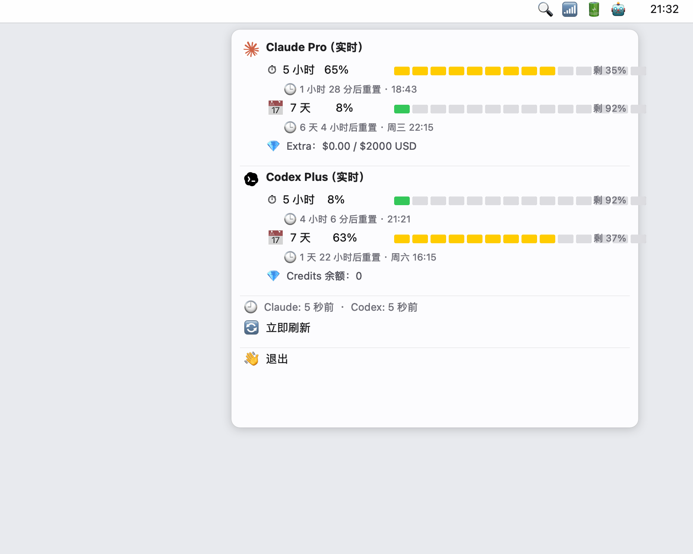

# 🟡⚫ AI Usage Bar

> A tiny macOS menu-bar widget that shows **real-time Claude Pro & ChatGPT Plus rate-limit usage**, pulled straight from the official APIs — no API key needed.

[](LICENSE)


<p align="center">
  
</p>

The Claude / ChatGPT desktop apps already display 5-hour and weekly usage somewhere deep inside settings. This widget pulls the **same numbers** from the same APIs they use and shows them in your menu bar all the time.

```
Menu bar:    🟡 65%  ⚫ 8%      ← Claude · ChatGPT 5h-window utilization

Dropdown:    [Claude logo] Claude Pro (live)
               ⏱ 5 hour:  65%   🟨🟨🟨🟨🟨🟨🟨⬜⬜⬜
                  reset in 1h 28m
               📅 7 day:   8%   🟩⬜⬜⬜⬜⬜⬜⬜⬜⬜
                  reset in 6d 5h
             ──────────────────────────────────
             [OpenAI logo] Codex Plus (live)
               ⏱ 5 hour:   8%   🟩⬜⬜⬜⬜⬜⬜⬜⬜⬜
                  reset in 4h 6m
               📅 7 day:  63%   🟨🟨🟨🟨🟨🟨⬜⬜⬜⬜
                  reset in 1d 23h
```

---

## ✨ Features

- **Real-time** — polls the official endpoints every 30s
- **Zero config** — auto-discovers your account from the desktop apps
- **No API key required** — uses your existing browser/desktop login
- **Local only** — credentials never leave your machine
- **Light** — ~120 MB RAM, ~1% CPU
- **Auto-start** — one-shot installer wires up a LaunchAgent
- **Color-coded** progress bars (green → yellow → orange → red)

---

## 📦 Requirements

You need **at least one of these two** installed and logged in:

| Provider | What's required |
|---|---|
| **Claude** | The [Claude Desktop](https://claude.ai/download) app (any plan — Pro / Max / Team) signed in. |
| **ChatGPT / Codex** | The [Codex CLI](https://github.com/openai/codex) signed in with a ChatGPT Plus/Pro account (run `codex login` once). |

If only one is set up, the widget will simply show that one and mark the other as unavailable.

System: **macOS 12+**, **Python 3.10+** (preinstalled via `python3`).

---

## 🚀 Install

```bash
git clone https://github.com/liamlai88/ai-usage-bar.git
cd ai-usage-bar
./install.sh
```

That's it. The script will:
1. Create a virtual env in `.venv/`
2. Install `rumps` and `pycryptodome`
3. Install & start the LaunchAgent → widget runs at every login

Look in the right side of your menu bar.

---

## 🔧 Manual run (for testing)

```bash
python3 -m venv .venv
source .venv/bin/activate
pip install -r requirements.txt
python claude_widget.py
```

---

## ⚙️ Configuration

Edit `config.py`:

```python
USD_TO_CNY = 7.20          # exchange rate (used only for legacy local cost estimates)
```

(More config knobs to come — refresh interval, status thresholds, etc.)

---

## 🔐 How it works (and why it's safe)

### Claude
1. Reads the encrypted session cookie from `~/Library/Application Support/Claude/Cookies` (SQLite).
2. Decrypts it using the **macOS Keychain** key (`Claude Safe Storage`).
3. Calls `GET https://claude.ai/api/organizations/{org_id}/usage` — the same endpoint the Claude desktop app uses internally.

### Codex / ChatGPT
1. Reads `~/.codex/auth.json` — created by `codex login`.
2. Uses the OAuth access token to call `GET https://chatgpt.com/backend-api/wham/usage` — the same endpoint the Codex CLI uses internally.

**Nothing is uploaded anywhere.** All network traffic goes only to the official Anthropic / OpenAI endpoints, using credentials already present on your machine. The widget is **read-only** — it never modifies your cookies or tokens.

---

## 🎛 Useful commands

```bash
# Stop / start the auto-launched widget
launchctl unload ~/Library/LaunchAgents/com.aiusagebar.plist
launchctl load -w  ~/Library/LaunchAgents/com.aiusagebar.plist

# Tail logs
tail -f /tmp/aiusagebar.err.log

# Uninstall completely
launchctl unload ~/Library/LaunchAgents/com.aiusagebar.plist
rm ~/Library/LaunchAgents/com.aiusagebar.plist
rm -rf .venv
```

---

## 🐛 Troubleshooting

**Menu bar shows "取数失败" / nothing**
- Make sure Claude Desktop and/or Codex CLI are installed and you've logged in at least once.
- On first run, macOS will ask for permission to read the Keychain entry `Claude Safe Storage` — click **Always Allow**.
- Check logs: `tail -f /tmp/aiusagebar.err.log`

**"Codex token 过期，请 codex login"**
- Run `codex login` in a terminal to refresh the OAuth token.

**Number doesn't match what the app shows**
- The widget polls every 30s. Click **🔄 立即刷新** to force-refresh.
- Anthropic / OpenAI's own UIs also have a small delay.

---

## 🤝 Contributing

PRs welcome! Especially:
- Support for **Gemini** / Cursor / other AI tools
- A SwiftUI rewrite for smaller memory footprint
- A real animated cat / mascot widget (see [`UI_DESIGN.md`](UI_DESIGN.md))
- Localization beyond zh-CN

---

## ⚠️ Disclaimer

This project is **not affiliated** with Anthropic or OpenAI. It uses **undocumented internal endpoints** that may change at any time. If a future update breaks the widget, please open an issue.

---

## 📜 License

MIT © Liam Lai
